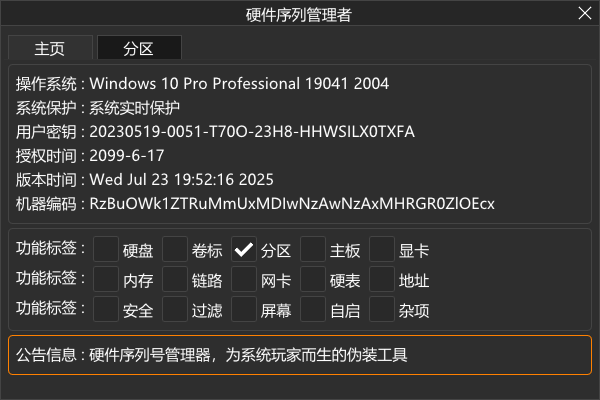

# 硬件序列号管理器：为系统玩家而生的伪装工具
你是否遇到过这种情况：重装系统后仍然被某些软件“识别”出来？你换了硬盘、改了MAC地址，但依旧逃不过某些程序的监控？

那你需要的，可能就是这款为深度玩家和系统极客打造的序列号管理神器。

本工具支持修改绝大多数硬件的唯一标识符，包括但不限于：
* 硬盘序列号（包括多块盘）
- 网卡 MAC 地址
* 主板 UUID
- 内存条序列号
* 显示器序列号
- 卷标、分区 GUID 等附加信息

通过修改这些关键参数，你的系统身份将从操作系统层面焕然一新，无需更换硬件、无须深入驱动层，轻松实现“数字伪装”。

本工具修改无痕、无驻留进程，全部修改行为在系统重启后自动恢复原始状态，**纯净不残留，测试更安心**。你可以放心在调试环境、系统模板克隆、软件验证、网络隔离、模拟环境等多个高端应用场景下使用它。

界面采用模块化设计，操作直观快速。每一项修改都有明确标记与实时反馈，配合稳定的版本控制机制，让你能放心地“重构身份”——如有必要，也能一键复原。

**如果你关心控制权、重视技术细节，又不想深入内核开发，那这款工具正是你灵活伪装与防追踪的利器。**

# 程序界面

# 用户密钥
**20230519-0051-T70O-23H8-HHWSILX0TXFA**

# 版本日志
[2025.06.14] 第一个版本，基本功能已经完善。

[2025.06.23] 第二次更新，加入禁用内存SPD序列号功能。

[2025.06.27] 第三次更新，加入自启动（未完成）、屏幕（未完成）、修复某些系统无法成功加载驱动问题。

[2025.06.29] 第四次更新，自启动支持硬盘、卷标、主板、网卡这四个功能了。

[2025.06.30] 第五次更新，优化一些自启动功能。

[2025.07.02] 第六次更新，优化主板信息按类型显示与修改。

[2025.07.03] 第七次更新，支持查看NVIDIA显卡信息，至于如何修改还在研究中。

# 程序视频
[程序使用教程](https://easylink.cc/ecc6rn)

[修改C盘分区教程](https://easylink.cc/7njvyr)

[禁用SPD内存教程](https://easylink.cc/1mjywm)

[设置自启动教程](https://easylink.cc/mitb6r)

# 在线文档
[金山文档](https://www.kdocs.cn/l/cad0y7MyhKkM)

# 下载地址
[蓝奏云 2025.07.03](https://wwqp.lanzouw.com/ioPXx307ndcj "立即下载")

# 问题反馈
[Telegram](https://t.me/indigosable)
